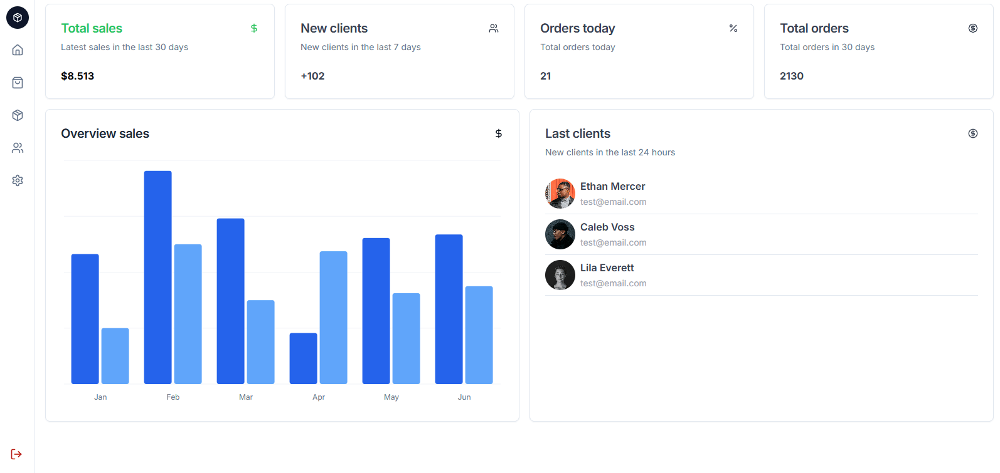

# Description
This project is a modern and responsive dashboard built with **Next.js** and **shadcn**, leveraging cutting-edge web technologies to deliver a seamless user experience. The design focuses on a clean and intuitive interface, **optimized for various devices** and screen sizes. With its scalable architecture, this dashboard serves as a robust foundation for data visualization, management, or any application requiring an efficient control panel.

# Main Features
- Next.js
- TypeScript
- Shadcn
- Responsive design

# Screenshot

